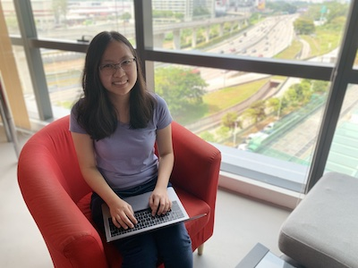

# About Me

Hi there! I'm Brenda Lau, an iOS Software Engineer from Kuala Lumpur 🇲🇾. I won the Apple's Worldwide Developer Conference Scholarship in 2018 and I graduated from Asia Pacific Univeristy with a Bachelors (Hons) in Information Technology. Currently, my learning interests are Machine Learning and Data Science. My mission in life is to help make people's lives better!

I created this site to log my learnings, showcase my projects, and write just about anything that interest me. You can check out my [resume](../files/brendalau-resume.pdf).

---

## Media Coverage 🗞

Buro Malaysia: In Conversation with Malaysian Women in Tech [part 1](https://www.buro247.my/lifestyle/career/malaysian-women-in-tech-interview-misconceptions-g.html), [part 2](https://www.buro247.my/lifestyle/career/malaysian-women-in-tech-interview-working-life-stu.html), [part 3](https://www.buro247.my/lifestyle/career/malaysian-women-in-tech-interview-industry-insider.html)

Malay Mail: [Young Malaysian developer's origami-inspired route to Apple's WWDC](https://www.malaymail.com/news/tech-gadgets/2018/05/31/young-malaysian-developers-origami-inspired-route-to-apples-wwdc/1636887), [Not just a boy's club](https://www.malaymail.com/news/tech-gadgets/2019/08/03/not-just-a-boys-club-talking-to-women-in-tech/1777206)

CNET: [Indonesian, Malaysian students earn WWDC trip for their coding efforts](https://www.cnet.com/news/indonesian-malaysian-students-earn-wwdc-trip-for-their-coding-efforts/)

---

## Contact ✉️
Lets get in touch! You can find me on [LinkedIn](https://www.linkedin.com/in/brendalaupg/), tweet me at [brendalaupg_](https://twitter.com/brendalaupg_) or [email](mailto: brendalaupg@hotmail.com) me.

